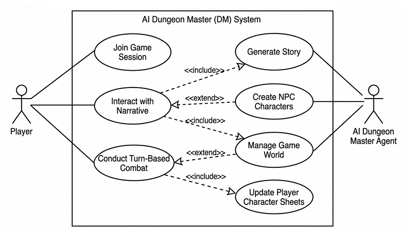

Hello, for this lab, I have completed the "Join Game Session" portion of my project.

To Run: 
# start server (on localhost, u can change ip if you want but that's uneccesary for testing)
python Lab14/lab14.py server --host 127.0.0.1 --port 8000

# in a separate terminal(s), join the server
python Lab14/lab14.py join --host 127.0.0.1 --port 8000 --session-id <id> --player-name digiliomon